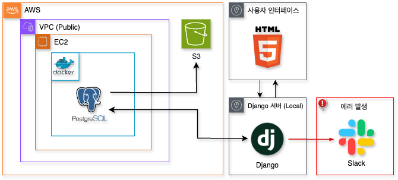
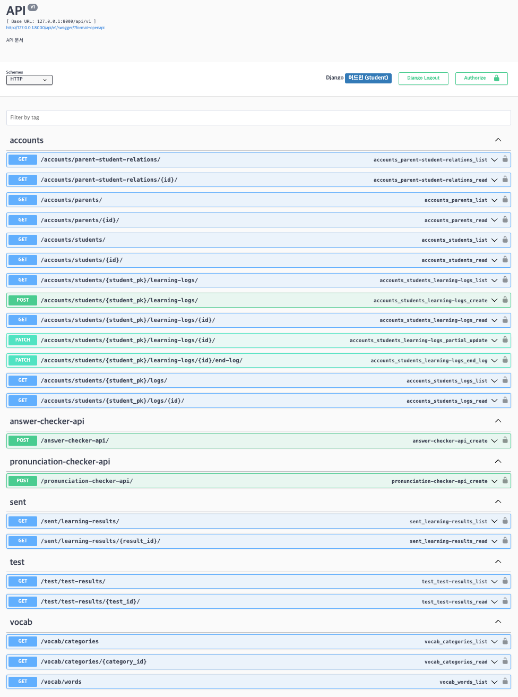

# SpellStars: 초등학생 영어 단어 학습 서비스

### 소개
SpellStars는 초등학생을 위한 몰입감 있는 영어 단어 학습 서비스입니다. 

기존의 암기 위주 방식에서 벗어나 음성 인식(STT) 기술을 활용하여 학생들이 직접 발음하며 학습할 수 있는 환경을 제공합니다. 

또한, 발음 교정을 통한 피드백과 예문 활용 학습으로 실생활 영어 회화 능력까지 향상시킬 수 있도록 설계되었습니다. 

### 주요 기능
- **STT 기반 발음 평가 및 학습 피드백**: 학생의 발음을 STT(Speech-to-Text) 기술로 평가하고 실시간 피드백을 제공합니다. 잘못 발음한 경우 적절한 피드백을 통해 학습 효과를 극대화합니다.
- **개인 맞춤형 학습 경험**: 학습자의 수준에 맞게 발음 평가 기준을 조정하며, 게임 요소를 추가하여 몰입도를 높입니다.
- **예문 학습 및 스피드 퀴즈**: 예문을 통한 단어의 실전 활용 학습과 AI와 경쟁하는 스피드 퀴즈를 통해 재미와 동기를 부여합니다.
- **발음 시각화**: 학생 발음과 원어민 발음의 차이를 시각적으로 보여주는 기능을 제공하여 스스로 발음을 교정할 수 있도록 돕습니다.

---

### 기술 스택

- **프로그래밍 언어 및 웹 프레임워크**  
    
    
  

- **데이터베이스 및 배포 환경**  
    
    
    
  

- **머신러닝 및 데이터 분석**  
    
    
    
  

- **협업 및 모니터링**  
    
  

---
### 주요 아키텍처
- **데이터 파이프라인 및 데이터베이스**: AWS EC2 인스턴스에서 Docker와 PostgreSQL을 사용하여 데이터베이스를 구성했습니다. 또한, 매일 AWS S3에 백업을 수행하여 데이터 손실을 방지합니다.
  
  


- **API 설계**: Django REST Framework를 사용하여 사용자 정보 조회, 데이터 조회, 발음 평가 등 다양한 API를 개발했습니다.

### API 문서
- **Swagger 지원**: 프로젝트에 구현된 API는 Swagger를 통해 확인할 수 있습니다.
  - Django 프로젝트를 실행한 후, 로그인을 하시고 아래 URL로 접속하여 Swagger 문서를 확인하세요:
    ```
    http://localhost:8000/api/v1/swagger/
    ```
  - Swagger UI를 통해 모든 엔드포인트를 테스트하고 문서를 확인할 수 있습니다.
  - [Swagger HUB](https://app.swaggerhub.com/apis/mane-9fd/api/v1)

  


### 서비스 구조
- **사전 학습 모드**: 카테고리별로 단어를 랜덤으로 선택하고 발음 연습을 진행합니다.
- **예문 학습 모드**: 학습한 단어를 다양한 예문에 적용하며 AI와 경쟁하는 형식으로 학습합니다.
- **시험 모드**: 예문을 통한 문제 풀이로 학습 내용을 평가합니다.
- **발음 연습 모드**: 점수와 관계없이 자유롭게 단어 발음을 연습할 수 있는 모드입니다.

### 기대 효과
- **몰입감 있는 학습**: 학생들이 발음과 게임 요소를 통해 자연스럽게 학습에 몰입할 수 있습니다.
- **개인 맞춤형 피드백**: 발음 평가 및 학습 결과를 바탕으로 맞춤형 피드백을 제공합니다.
- **효율적 학습 관리**: 학습 통계 대시보드를 통해 학습 모드별 총 학습 시간, 시험 점수 변화 등을 한눈에 확인할 수 있습니다.

### 한계 및 개선 사항
- **발음 인식 정확도**: 현재 STT 모델의 한계로 인해 주변 소음을 정확히 처리하지 못하는 경우가 발생할 수 있습니다. 향후 더 높은 정확도의 모델로 교체할 계획입니다.
- **UI 및 학습 경험 개선**: 천재교육의 캐릭터를 추가하고 보상 시스템을 도입하여 학생들의 몰입감과 학습 동기를 더욱 강화할 예정입니다.

### 설치 및 실행 방법

1. PostgreSQL 설정 및 연결
   - Docker Compose를 사용하여 PostgreSQL 서버를 먼저 실행합니다. 아래 명령어를 사용하여 PostgreSQL 서버를 실행하십시오.
     ```bash
     docker-compose up -d
     ```
   - PostgreSQL 서버가 실행된 후, 프로젝트를 클론하여 `settings.py` 파일을 수정합니다.
   - Django 프로젝트의 `settings.py` 파일에서 데이터베이스 설정을 다음과 같이 변경합니다:
   ```python
   DATABASES = {
       "default": {
           "ENGINE": "django.db.backends.postgresql",
           "NAME": "engdb",
           "USER": "user",
           "PASSWORD": "1234",
           "HOST": "localhost",
           "PORT": "5433",  # PostgreSQL의 포트
           'CONN_MAX_AGE': 600,
       }
   }
   ```

2. 프로젝트를 클론합니다.
   ```bash
   git clone https://github.com/online5880/eng-word
   cd <repository-directory>
   ```
3. Python 3.9.20을 설치합니다.
4. 가상 환경을 생성하고 활성화합니다.
   ```bash
   python -m venv venv
   source venv/bin/activate  # Windows의 경우 'venv\Scripts\activate'
   ```
5. 필요 라이브러리를 설치합니다.
   ```bash
   pip install -r requirements.txt
   ```
6. spell_star 폴더로 이동합니다.
    ```
    cd spell_stars/
    ```
7. Django 서버를 실행합니다.
   ```bash
   python manage.py runserver
   ```

### 팀 정보
- **팀명**: 스펠스타즈 (SpellStars)
- **팀원 및 역할**:
  
  | 이름   | 역할                                   |
  |--------|----------------------------------------|
  | 전동인 | 영어 학습 데이터 수집(예문생성) 파이프 라인 구축, 발음 평가 파이프 라인 구축, 예문학습 및 AI 알고리즘 설계, API 구축, 발표 |
  | 정승연 | 예문 번역 및 데이터베이스 적재 파이프라인 구축, ERD 설계, 서비스 구축(시험 모드, 발음연습, 결과 대시보드), API 구축, 발표 PPT 제작 |
  | 곽태경 | 데이터 크롤링 및 전처리, 모델 파인 튜닝, 모델 성능 최적화 및 평가, 시연 영상 제작 |
  | 박만혜 | 데이터 파이프라인 및 데이터베이스 구축, 서비스 개발(사전학습, 예문학습), Django 로그인 및 사용자 관리, 관리자 인터페이스 개발, API 구축, 시스템 아키텍처 설계 및 클라우드환경구축 |

### 라이선스
이 프로젝트는 BSD 라이선스를 따릅니다.

## 결과 영상
[](https://www.youtube.com/watch?v=uPNhYz-kT-c)

### 참고 자료
- [Whisper fine-tuning : Hugging Face 모델 링크](https://huggingface.co/oxorudo/whisper_ssokssokword)

